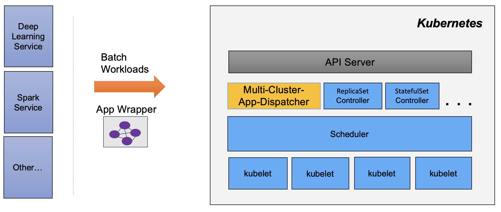

Multi-Cluster App Dispatcher
==

The `multi-cluster-app-dispatcher` is a Kubernetes controller providing mechanisms for applications to manage batch jobs in a single or multi-cluster environment.

The `multi-cluster-app-dispatcher` (`MCAD`) controller is capable of (i) providing an abstraction for wrapping all resources of the job/application and treating them holistically, (ii) queuing job/application creation requests and applying different queuing policies, e.g., First In First Out, Priority, (iii) dispatching the job to one of multiple clusters, where a `MCAD` queuing agent runs, using configurable dispatch policies, and (iv) auto-scaling pod sets, balancing job demands and cluster availability (future work).

## Build Information

Follow the [build instructions here](./doc/build/build.md) to build the Multi-Cluster-App-Dispatcher controller.

## Deployment Information

Refer to [deployment instructions here](./doc/deploy/deployment.md) on how to deploy the `multi-cluster-app-dispatcher` as a controller in Kubernetes.

## Release Process

1. Update version in [CONTROLEER_VERSION file](https://github.com/project-codeflare/multi-cluster-app-dispatcher/blob/main/CONTROLLER_VERSION) to the new release version.

2. Once CONTROLLER_VERSION file change merged , create the release branch against the main as `release-<version>`.

3. The release branch then trigger the [image build/push pipeline](https://app.travis-ci.com/github/project-codeflare/multi-cluster-app-dispatcher/branches) and push the image to [mcad-controller quay repository](https://quay.io/repository/project-codeflare/mcad-controller?tab=tags) with specified release version tag.

4. Create a new release on [Releases page](https://github.com/project-codeflare/multi-cluster-app-dispatcher/releases) by creating a tag with same value as in CONTROLLER_VERSION file formatted (with v prefix) , provide proper release title and description.

5. The latest release changes should also reflect in the [mcad go package module](https://pkg.go.dev/github.com/project-codeflare/multi-cluster-app-dispatcher).

## Tutorial

Refer to the [tutorial](./doc/usage/tutorial.md) on how to use `multi-cluster-app-dispatcher` to run batch job in Kubernetes

## Overall Architecture

