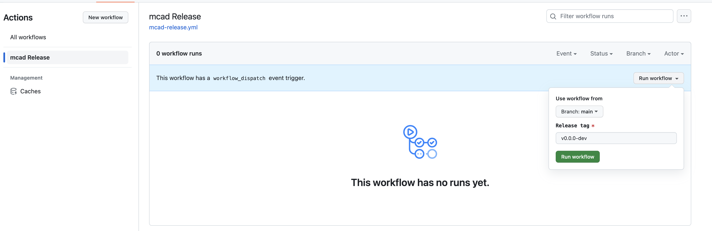

<p align="center">

</p>

[](http://www.apache.org/licenses/LICENSE-2.0)
[](https://github.com/project-codeflare/multi-cluster-app-dispatcher/issues)

Multi-Cluster App Dispatcher
==

The `multi-cluster-app-dispatcher` is a Kubernetes controller providing mechanisms for applications to manage batch jobs in a single or multi-cluster environment.

The `multi-cluster-app-dispatcher` (`MCAD`) controller is capable of (i) providing an abstraction for wrapping all resources of the job/application and treating them holistically, (ii) queuing job/application creation requests and applying different queuing policies, e.g., First In First Out, Priority, (iii) dispatching the job to one of multiple clusters, where a `MCAD` queuing agent runs, using configurable dispatch policies, and (iv) auto-scaling pod sets, balancing job demands and cluster availability (future work).


## Build Information

Follow the [build instructions here](./doc/build/build.md) to build the Multi-Cluster-App-Dispatcher controller.

## Deployment Information

Refer to [deployment instructions here](./doc/deploy/deployment.md) on how to deploy the `multi-cluster-app-dispatcher` as a controller in Kubernetes.

Alternatively, for a quick deployment, you can use the `easy-deploy` make target to build, push, and deploy your custom image of MCAD on your Kubernetes cluster:
```
make easy-deploy TAG=<image tag> USERNAME=<quay.io username>
```
Note: Ensure you are logged into your quay.io account on your local machine, and your kubeconfig is pointing to the cluster you want to deploy MCAD on.

## Release Process

1. Run the [mcad-release.yml](https://github.com/project-codeflare/actions/workflows/mcad-release.yml) action under `Actions` by entering the new release version in the `Release tag` input field and click `Run workflow`.
   

2. Verify that [mcad-release.yml](https://github.com/project-codeflare/actions/workflows/mcad-release.yml) action passed successfully. The workflow will Build and push the image to [mcad-controller quay repository](https://quay.io/repository/project-codeflare/mcad-controller?tab=tags) with specified release version tag and create GitHub release tag.

3. Verify a new release is created on the [Releases page](https://github.com/project-codeflare/multi-cluster-app-dispatcher/releases).

4. The latest release changes should also reflect in the [mcad go package module](https://pkg.go.dev/github.com/project-codeflare/multi-cluster-app-dispatcher).

## Tutorial

Refer to the [tutorial](./doc/usage/tutorial.md) on how to use `multi-cluster-app-dispatcher` to run batch job in Kubernetes

## Overall Architecture


