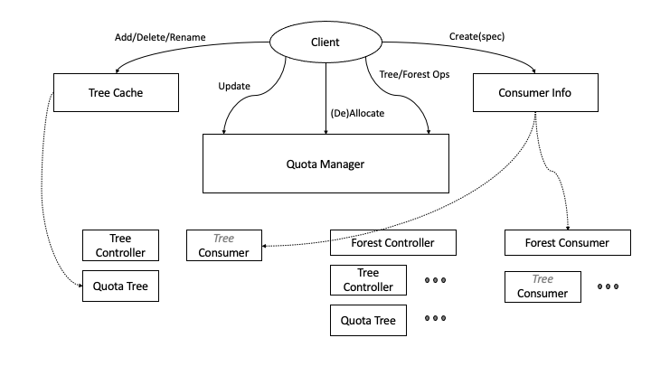

# quota-manager: Hierarchical quota management

This is concerned with a quota management library where a hierarchical quota tree is defined through a JSON file. Quotas are assigned to a multitude of resources (CPU, memory). A consumer requesting a specified amount of resources and a member of a leaf node in the quota tree is checked against the quota limitations and is either allocated successfully or rejected. Consumers have priorities and a preemptable option. The quotas may be applied with a Hard or Soft constraint.

An outline of the [algorithm](docs/quota-algorithm.pdf) is provided.

An [example](docs/tree-example.pdf) scenario is described along with its corresponding [output](docs/tree-example.txt).

## Basic concepts

**Allocation**, **Quota**, **Request**: An Allocation is a vector of integers, one for each member of a given set of resource types, e.g. [CPU, memory]. An Allocation of [5, 32] means that 5 CPU units and 32 memory units are allocated. A Quota is an upper limit (maximum) on an Allocation, e.g. [16, 512]. And, a Request is the amount requested by a consumer, e.g. [1, 16].

**Quota Tree** (or **Tree**): A Quota Tree (or simply referred to as a Tree) is a tree where each node represents some grouping of consumers in a hierarchy. Each tree has a unique name. A Quota is associated with each node, representing the maximun resources allowed for such a grouping. Leaf nodes are concrete groups that consumers belong to, such as teams and projects. The leaf node where a consumer is assigned is referred to as the consumer group node (or *gNode*). Internal (non-leaf) nodes correspond to groups of groups, such as departments and organizations. An quota indicator (*Soft/Hard*) at a node signifies whether a consumer can satisfy its request by seeking allocation from the parent node (*Soft*) or not (*Hard*), in case the request cannot be fulfilled at the node level. The node where a consumer receives its request is referred to as the consumer allocated node (or *aNode*), which could be any node along the path from the *gNode* to the *root*, assuming that all nodes along the path are designated as *Soft*. (The *root* node is *Hard* by definition.) An example specification of a tree follows.

```json
{
  "kind": "QuotaTree",
  "metadata": {
    "name": "TestTree"
  },
  "spec": {
    "resourceNames": [
      "cpu",
      "memory"
    ],
    "nodes": {
      "A": {
        "parent": "nil",
        "hard": "true",
        "quota": {
          "cpu": "10",
          "memory": "256"
        }
      },
      "B": {
        "parent": "A",
        "hard": "true",
        "quota": {
          "cpu": "2",
          "memory": "64"
        }
      },
      "C": {
        "parent": "A",
        "hard": "false",
        "quota": {
          "cpu": "6",
          "memory": "64"
        }
      },
    }
  }
}
```

**Consumer**: A requestor of resources. A consumer specifies a tree, a leaf group node (*gNode*) in the tree, and the requested amount of resources. If allocated, the consumer will be assigned an allocation node (*aNode*) in the tree, otherwise the allocation request is rejected. Typically the *aNode* is the same as the *gNode*. However, if there is not enough resources available at the *gNode*, the requested resources may be fulfilled by sharing available resources at a node along the path from the *gNode* to the *root* of the tree. The *aNode* may change during the lifetime of the consumer depending on the departure (completion) of other consumers and arrivals of new consumers. An example of a consumer specification follows.

```json
{
  "kind": "Consumer",
  "metadata": {
    "name": "consumer-data"
  },
  "spec": {
    "id": "consumer-1",
    "trees:": [
      {
        "treeName": "ExampleTree",
        "groupID": "C",
        "request": {
          "cpu": 4,
          "memory": 16
        },
        "priority": 0,
        "type": 0,
        "unPreemptable": true
      }
    ]
  }
}
```

**Preempted Consumers**: When attempting to allocate a consumer, other, already allocated consumers may be preempted, if such consumers are marked as *Preemptable*. Preemption may happen during the allocation of a higher priority consumer. It may also occur otherwise, in case a new consumer is claiming resources at a lower level than the level at which the preempted consumer is allocated shared resources. Preempted consumers are automatically de-allocated from the tree. A list of the preempted consumers is given in the `AllocationResponse` of the Allocate method.

**Forest** (or **multi-trees**): A collection of (one or more) quota trees treated simultaneously when allocating a consumer, requesting resources from multiple trees. Each forest has a unique name. A consumer specifies a list of trees, each with a tree name, a *gNode*, and a request. (Indiviadual trees may have their own sets of resource types.) The allocation request is satisfied only if the individual requests are satisfied on *ALL* the trees in the forest, i.e. conjointly satisfied. An example of a forest consumer specification follows.

```json
{
  "kind": "Consumer",
  "metadata": {
    "name": "consumer-data"
  },
  "spec": {
    "id": "job-1",
    "trees": [
      {
        "treeName": "ContextTree",
        "groupID": "Context-4",
        "request": {
          "cpu": 2
        },
        "priority": 0
      },
      {
        "treeName": "ServiceTree",
        "groupID": "Srvc-X",
        "request": {
          "cpu": 2,
          "disk": 1
        },
        "priority": 0
      }
    ]
  }
}
```

Consumer specifications are kept in a `ConsumerInfo` object. A `Consumer` object is a realization instance for a given tree (also referred to as Tree Consumer). A `ForestConmsumer` object is a realization instance for a given forest; It consists of multiple tree `Consumer` objects. A client of the `QuotaManager` first creates a `ConsumerInfo`, then, using the `consumerID` of the `ConsumerInfo`, requests to allocate and deallocate the consumer on either a single tree or a forest of trees.

## Dynamic Tree Updates

Each [Tree](quota/core/quotatree.go) has a [Controller](quota/core/treeController.go) to manage the allocation and de-allocation of consumers on the tree. The Controller keeps the allocation state of the tree in memory. In order to allow for dynamic changes to the tree, such as tree topology, node names, and node quota values, a [Cache](quota/core/treecache.go) is provided where all updates are kept. Whenever updates in the Cache are to take effect, the method UpdateTree() is called. Then, the Controller will refresh the tree to match all updates in the cache. Examples are provided [here](demos/updates).

## Quota Manager Interface

A high-level interface is provided through a [Quota Manager](quota/quotamanager.go). A summary of the interaction between a client and the Quota Manager is depicted below.



The Quota Manager is in one of two modes.

1. **Maintenance**: Allocation requests are treated as forced allocation on consumer group nodes (gNodes). Tree updates are kept in the cache. This is the default initial mode.
2. **Normal**: Allocation and de-allocation requests are handled in the normal way. Tree updates are kept in the cache.

A summary of the API interface to the Quota Manager follows.

- Management
  - create a new quota manager
    - `NewManager()`
  - get/set mode
    - `GetMode()`
    - `SetMode(mode)`
  - get information
    - `GetTreeNames()`
    - `GetForestNames()`
    - `GetForestTreeNames()`
  - update all single trees and forests from caches
    - `UpdateAll()`
- Consumers (first create a `ConsumerInfo` from JSON specifications)
  - `AddConsumer(consumerInfo)`
  - `RemoveConsumer(consumerID)`
  - `GetAllConsumerIDs()`
- Trees
  - add a tree
    - `AddTreeByName(treeName)`
    - `AddTreeFromString(treeJsonString)`
    - `AddTreeFromStruct(treeJsonStruct)`
  - delete a tree
    - `DeleteTree(treeName)`
- Tree consumers allocation
  - allocation (returns `AllocationResponse`)
    - `Allocate(treeName, consumerID)`
  - de-allocation
    - `DeAllocate(treeName, consumerID)`
  - check allocation
    - `IsAllocated(treeName, consumerID)`
- Tree Updates
  - tree cache (get a `TreeCache` object on which modifications can be made)
    - `GetTreeCache(treeName)`
  - refresh (effect) updates from cache
    - `UpdateTree(treeName)`
- Forests
  - add a forest
    - `AddForest(forestName)`
  - delete a forest
    - `DeleteForest(forestName)`
  - add a tree to a forest
    - `AddTreeToForest(forestName, treeName)`
  - delete a tree from a forest
    - `DeleteTreeFromForest(forestName, treeName)`
- Forest consumers allocation
  - allocation (returns `AllocationResponse`)
    - `AllocateForest(forestName, consumerID)`
  - de-allocation
    - `DeAllocateForest(forestName, consumerID)`
  - check allocation
    - `IsAllocatedForest(forestName, consumerID)`
- Forest Updates
  - refresh (effect) updates from caches
    - `UpdateForest(forestName)`
- Undo consumer allocation: Two calls are provided to try to allocate a consumer, and if unaccepted, to undo the effect of the allocation trial. If the trial is accepted, no further action is needed. Otherwise, the undo has to be called right after the try allocation, without making any calls to change the trees or allocate/deallocate consumers. These operations are intended only during Normal mode.
(Note: This design pattern puts the burden on the caller of the quota manager to make sure that TryAllocate() and UndoAllocate() are run in an atomic fashion. So, a lock is needed for that purpose. An example is provided in the TestQuotaManagerParallelTryUndoAllocation() in [quotamanagerundo_test.go](quota/quotamanagerundo_test.go))
  - `TryAllocate(treeName, consumerID)`
  - `UndoAllocate(treeName, consumerID)`
  - `TryAllocateForest(forestName, consumerID)`
  - `UndoAllocateForest(forestName, consumerID)`

Examples of using the Quota Manager in the case of a [single tree](demos/manager/tree/demo.go) and a [forest](demos/manager/forest/demo.go) are provided.

## Notes

- Quota-manager is implemented as single threaded, thus all calls are blocking.
- All names (forest, tree, consumer) are assumed to be unique within their domain.
- Allocating a consumer on a forest will allocate on the trees in the intersection of the set of trees defined by the forest and the set of trees defined by the consumer specification.
- One could treat a tree as a forest of a single tree, however, for convenience, operations on a single tree (as well as on a forest) are provided.
- For simplicity, a tree is limited to belong to only one forest.
